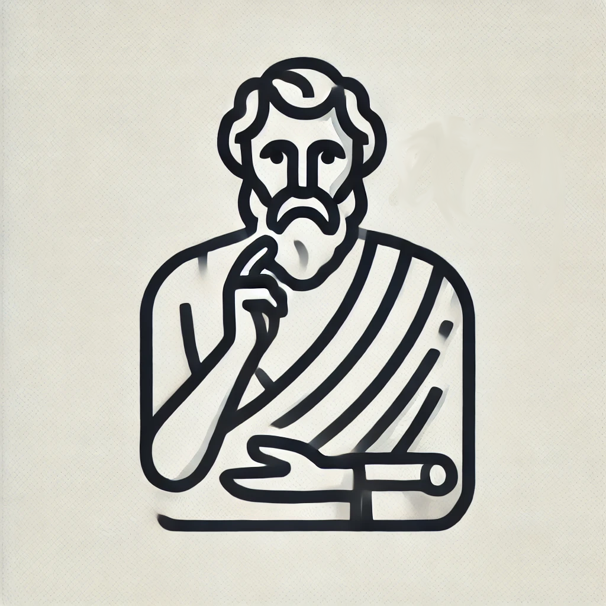

# Socratic: Learn Anything


This repository contains a Python script for teaching any topic using the Socratic method. The program guides the user through a series of questions, gradually increasing in complexity, to deepen their understanding of a topic.

## What is the Socratic Method?

The Socratic method is a form of cooperative argumentative dialogue between individuals, typically based on asking and answering questions to stimulate critical thinking and to draw out ideas and underlying presuppositions. It is named after the classical Greek philosopher Socrates and is introduced by him in Plato's 'Theaetetus' as midwifery (Maieutics).

## Features

- **Incremental Learning**: Questions start at a high-school level and gradually increase in complexity to college or graduate level.
- **Customizable Iterations and Levels**: Users can specify the number of iterations and the starting and ending complexity levels.

## How to Use

1. Clone the repository:
    ```sh
    git clone https://github.com/your-username/Socratic-Learn-Anything-Ollama.git
    ```
2. Navigate to the repository directory:
    ```sh
    cd Socratic-Learn-Anything-Ollama
    ```
3. Ensure you have the necessary libraries installed. Check [Installation](#Installation)
4. Run the Python script:
    ```sh
    python3 socrates.py
    ```
5. Follow the prompts to enter the topic you want to learn, confirm the generated prompt, and specify the teaching iterations and complexity levels.

## Installation

Ensure you have the required Python libraries:
```sh
pip3 install ollama
```
* By default this code use `llama3.1` as client.

## Configuration

Download and install ollama from [https://ollama.com/](https://ollama.com/). 

> DEFAULT SETUP USES `llama3.1` client.

## Example Usage

Upon running the script, you will be prompted to:
- Enter the topic you want to learn.
- Confirm the generated prompt.
- Specify the number of iterations (default is 50).
- Set the starting and ending complexity levels (default is high-school to graduate).

The program will then guide you through a series of questions to help you learn the topic deeply.

## Contributions

Contributions are welcome! Please feel free to submit a Pull Request.

## License

This project is licensed under the MIT License.
